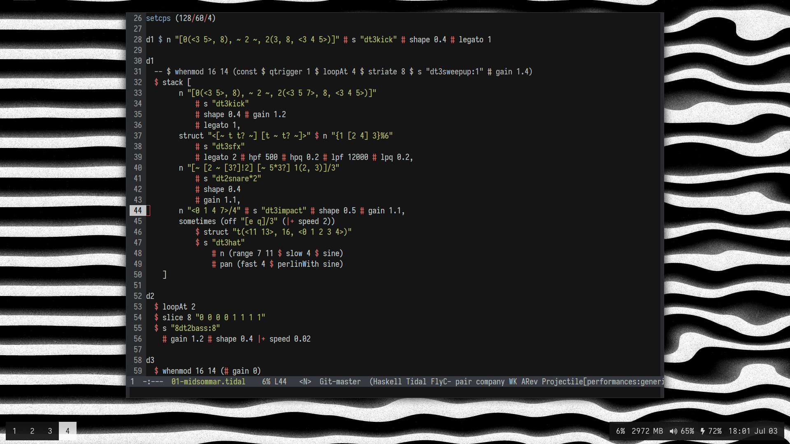

# .dotfiles


## Installation
```sh
$ git clone https://github.com/yacodes/dotfiles.git ~/.dotfiles
$ cd ~/.dotfiles
$ ./install.sh
```

If you already have some systems configured the installation script will not rewrite it. You should move them manually. Like this, for example: `$ mv ~/.zshrc ~/.zshrc.bak`.

## Emacs

My editor of choice is Emacs with [custom configuration in Emacs Lisp](./init.el).

