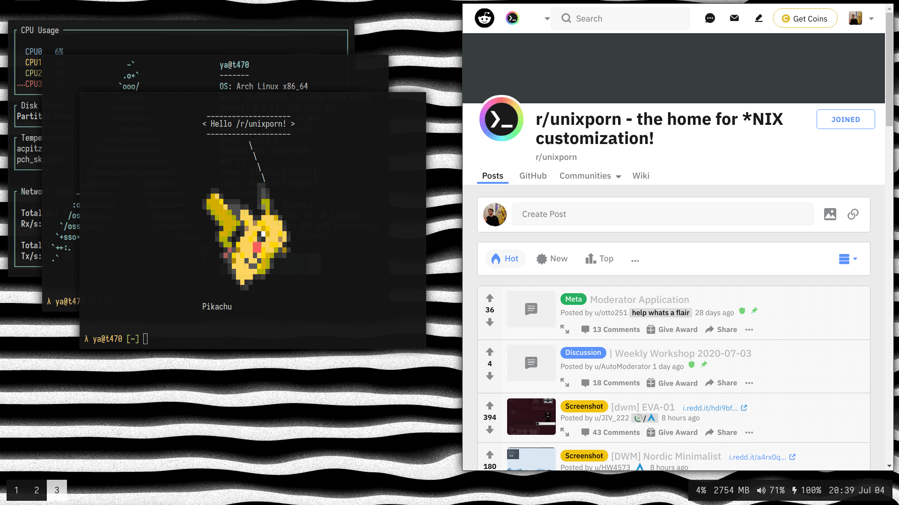
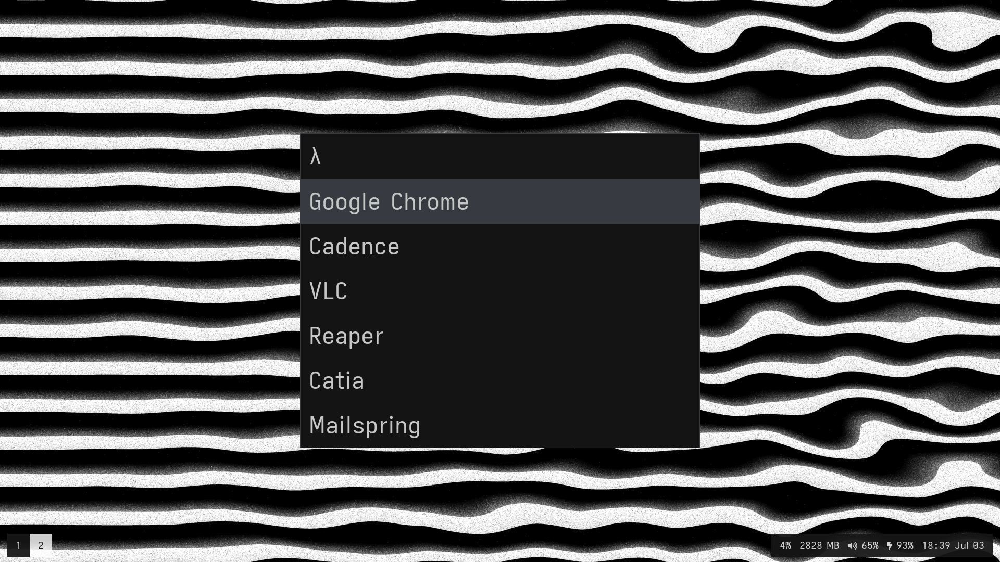
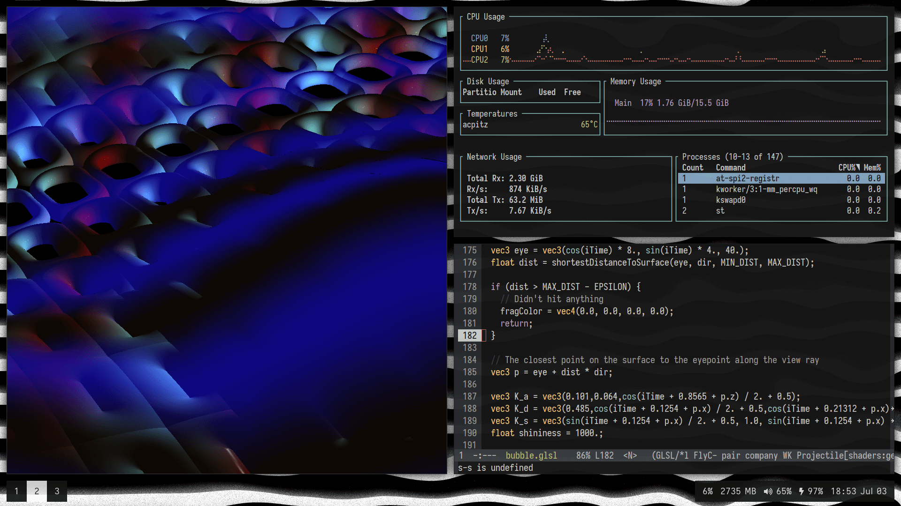
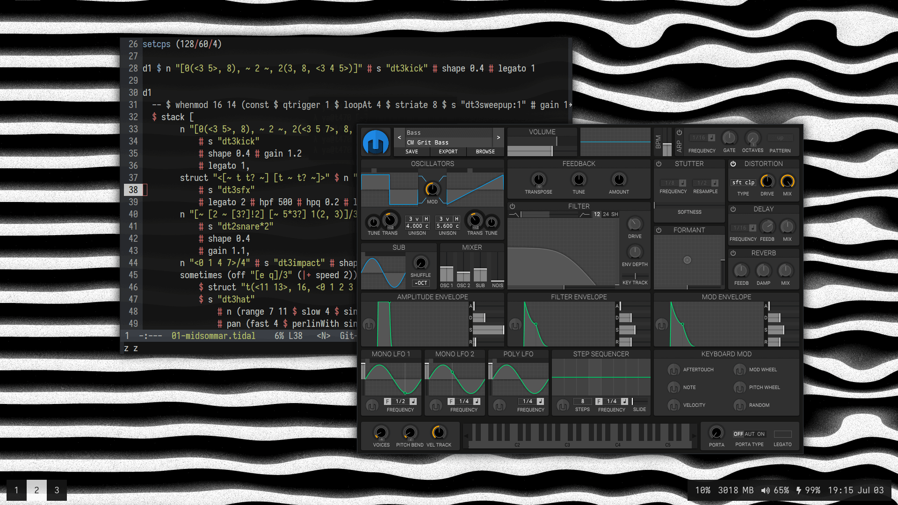

# .dotfiles


## Software

- **WM:** [i3-gaps](https://github.com/Airblader/i3)
- **Bar:** [polybar](https://github.com/polybar/polybar)
- **Font:** [Iosevka](https://typeof.net/Iosevka/)
- **Shell:** [zsh](https://wiki.archlinux.org/index.php/zsh)
- **Distro:** [Arch Linux](https://www.archlinux.org/)
- **Editor:** [Emacs](https://www.gnu.org/software/emacs/)
- **Launcher:** [rofi](https://github.com/davatorium/rofi)
- **Wallpaper:** [glsl fragment](./wallpaper.glsl)
- **Compositor:** [picom](https://github.com/yshui/picom)

## Installation
```sh
$ git clone https://github.com/yacodes/dotfiles.git ~/.dotfiles
$ cd ~/.dotfiles
$ ./install.sh
```

If you already have some systems configured, then the installation script will not rewrite it. You should move them manually as backups: `$ mv ~/.zshrc ~/.zshrc.bak`. Then run the script again.

## Screenshots








