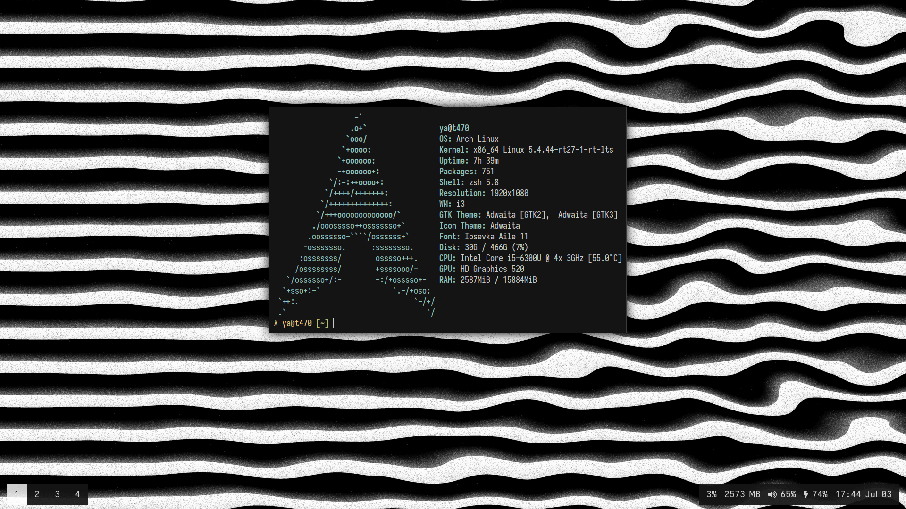

# .dotfiles



## Software

- **Distro:** [arch](https://www.archlinux.org/);
- **Shell:** [zsh](https://wiki.archlinux.org/index.php/zsh);
- **Editor:** [emacs](https://www.gnu.org/software/emacs/);
- **Window Manager:** [i3-gaps](https://github.com/Airblader/i3);
- **Compositor:** [picom](https://github.com/yshui/picom);
- **Bar:** [polybar](https://github.com/polybar/polybar);
- **Launcher:** [rofi](https://github.com/davatorium/rofi);
- **Font:** [iosevka](https://typeof.net/Iosevka/);
- **Wallpaper:** [glsl fragment](./wallpaper.glsl).

## Installation
```sh
$ git clone https://github.com/yacodes/dotfiles.git ~/.dotfiles
$ cd ~/.dotfiles
$ ./install.sh
```

If you already have some systems configured, then the installation script will not rewrite it. You should move them manually. Like this, for example: `$ mv ~/.zshrc ~/.zshrc.bak`.

## Screenshots